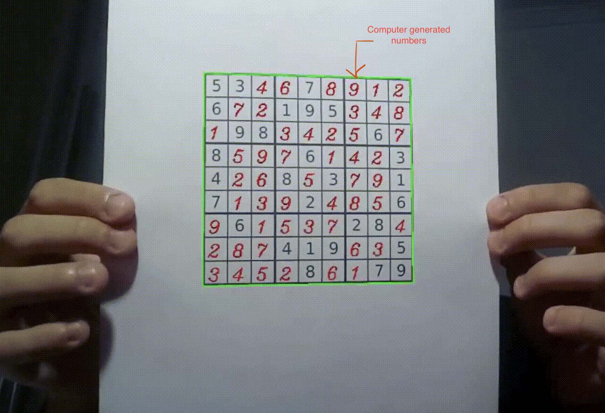

# Real-Time-Sudoku-Solver
 
## How to run:

IDE required- Pycharm Community Edition 
Copy the folder to C:/user/username/pycharmprojects/
then open pycharm and Run the file

## Requirments:

 * Python 3.9.0
 * Cv2
 * Scipy
 * Numpy
 * Keras
 
 

